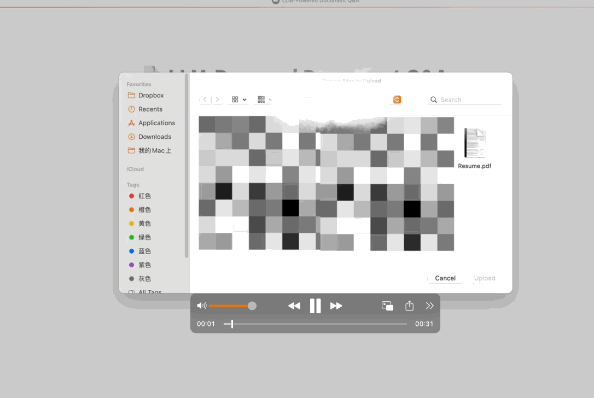

# 📄 LLM-Powered Document Q&A System

A lightweight yet powerful prototype that transforms any uploaded PDF document (e.g., resumes, product manuals) into an interactive Q&A system powered by OpenAI, LangChain, and Streamlit.

> 🔍 "Ask questions in natural language. Get answers from your documents. No training needed."

---

## 🚀 Live Demo 

<!-- Add GIF or screenshot if available -->


---

## 💡 Key Features

- 📎 Upload any PDF document (resume, handbook, brochure)
- 🔍 Automatically chunks and embeds the document using OpenAI Embeddings (`text-embedding-ada-002`)
- 💾 Stores vector representations in FAISS for fast retrieval
- 💬 Asks natural language questions using OpenAI's Chat API via LangChain's `RetrievalQA`
- 🌐 Fully interactive Streamlit interface — no coding required to use

---

## 🧠 Use Cases

| Use Case             | Description                                             |
|----------------------|---------------------------------------------------------|
| Resume Intelligence  | Summarize education, projects, or experience from a CV  |
| Technical Manuals     | Ask specific questions from device manuals              |
| Document Search Bot   | Query large PDFs like whitepapers or contracts          |

---

## 🛠️ Tech Stack

- **LangChain** – for document loaders, splitting, embedding & QA chain
- **OpenAI Embeddings** – using `text-embedding-ada-002`
- **FAISS** – for fast similarity search over vectorized document chunks
- **Streamlit** – for building an easy-to-use frontend
- **python-dotenv** – to manage API keys securely

---

## 📦 Installation

### 1. Clone the repository

```bash
git clone https://github.com/your-username/llm-doc-qa.git
cd llm-doc-qa
```

### 2. Install dependencies

```bash
pip install -r requirements.txt
```

### 3. Create your .env file

```bash
cp .env.example .env
```

Edit .env and replace the placeholder with your actual OpenAI API key:
```env
OPENAI_API_KEY=sk-xxxxxxxxxxxxxxxxxxxxxxxxxxxxxxxxxx
```

## Running the App

```bash
streamlit run doc_chunk_demo.py
```
Open http://localhost:8501 in your browser to start interacting.

##  Example Questions

Once you upload a resume or document, try questions like:

- Please summarize the project experience.

- What degrees does this person have?

- List key skills mentioned in this document.

## Project Structure
```bash
llm-doc-qa/
├── doc_chunk_demo.py      # Main Streamlit application
├── requirements.txt       # Dependencies
├── .env.example           # Sample environment config
├── .gitignore             # Ignore .env, cache files, index
└── README.md              # This file

```

## Security Notes

- Never commit your .env file with real API keys.

- This project uses .gitignore to prevent secrets from being uploaded.


## Credits

Created by Ranran Hu
Part of a portfolio to demonstrate LLM integration skills with real-world document workflows.


## Let's Connect

If you're a recruiter or engineer interested in NLP, LLM integration, or intelligent agents:

🔗 LinkedIn : https://www.linkedin.com/in/ranran-hu-303154152/

✉️ Email: huranran8@gmail.com


##  Future Work

-  Support DOCX/TXT/HTML document formats

- Add multi-turn chat memory

- Deploy via Streamlit Cloud or Hugging Face Spaces

